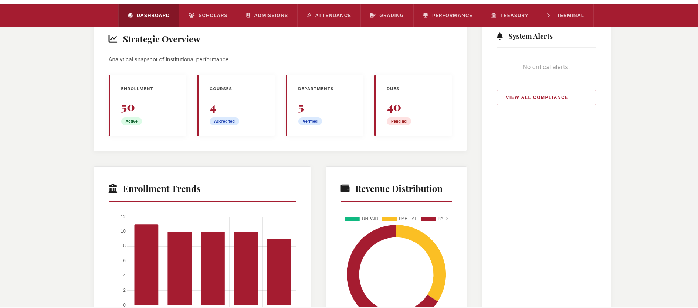
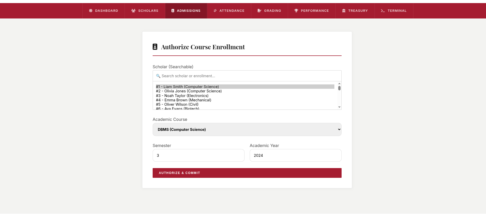
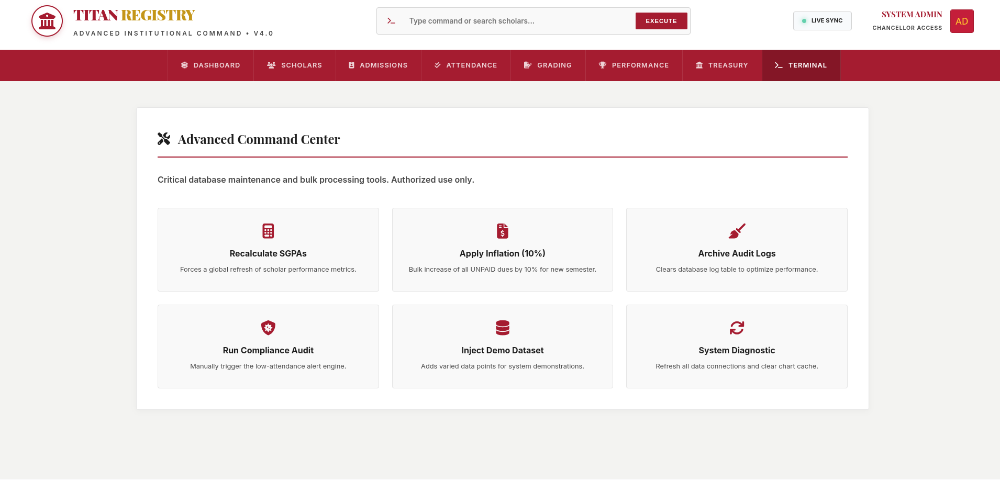

# 🏛️ TITAN COMMAND | Advanced Institutional ERP

<p align="center">
  
  <br>
  <b>A High-Performance, Panoramic Student Information System</b>
</p>

---

**TITAN COMMAND** is a sophisticated Enterprise Resource Planning (ERP) platform tailored for modern educational institutions. It provides a "Panoramic" command center for administrators to manage students, faculty, academics, and finances with real-time data synchronization and advanced database integrity.

## 🚀 Core Modules

- **📊 Dashboard Command:** High-level overview of institutional health with real-time metrics.
- **🎓 Scholar Registry:** Full lifecycle management of student data from admission to graduation.
- **📚 Academic Engine:** Robust course management, faculty allocation, and semester scheduling.
- **💰 Treasury (Fee Management):** Automated billing, payment tracking, and financial reporting.
- **📈 Performance Suite:** Integrated grading system and attendance tracking with visual analytics.
- **🛡️ Audit & Security:** Industrial-grade audit logs and database triggers for maximum data reliability.

## 📸 System Preview

<p align="center">
  
  
  
</p>

## 🛠️ Technology Stack

| Layer | Technologies |
| :--- | :--- |
| **Frontend** | Vanilla JavaScript (ES6+), CSS3 (Modern Flex/Grid), Chart.js, FontAwesome |
| **Backend** | Node.js, Express.js |
| **Database** | MySQL (Complex Schema, Stored Procedures, Triggers) |
| **DevOps** | Dotenv, Nodemon |

## ⚙️ Quick Start

### 1. Prerequisites
- [Node.js](https://nodejs.org/) (v14+)
- [MySQL](https://www.mysql.com/) Server

### 2. Database Setup
Execute the SQL scripts in order to initialize the schema and business logic:
```bash
mysql -u root -p < database/init.sql
mysql -u root -p < database/triggers.sql
mysql -u root -p < database/alerts.sql
mysql -u root -p < database/missing_logic.sql
```

### 3. Backend Configuration
Navigate to the backend directory and install dependencies:
```bash
cd backend
npm install
```
Edit `.env` if your MySQL credentials differ from the defaults:
```env
DB_PASS=Hello_MYSQL
DB_USER=root
```

### 4. Launch
```bash
npm start
```
Open `http://localhost:3000` in your browser to enter the command center.

## 📁 Project Structure

```text
├── backend/            # Express server and API logic
│   ├── db/            # Database connection pool
│   ├── public/        # Frontend Panoramic UI
│   └── server.js      # Main entry point
├── database/           # SQL Schema and Logic files
└── image[1-3].png      # System Screenshots
```

---
<p align="center">
  Built for <b>Database Management Systems</b> project.
</p>
