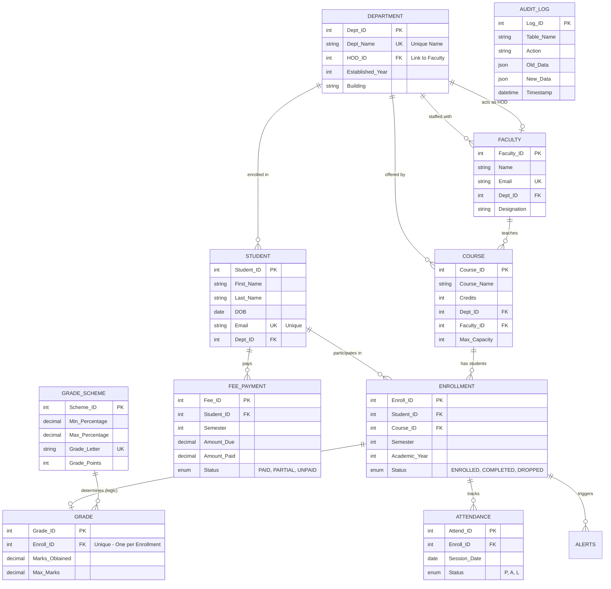

# SIS TITAN - Entity Relationship Diagram

This diagram represents the normalized, ACID-compliant schema of the Student Information System.

## Mermaid ER Diagram

## Entity Details

### 1. Core Entities
- **Student**: Contains personal and academic registration info.
- **Faculty**: Contains teaching staff details.
- **Department**: The organizational unit owning courses and students.

### 2. Academic Entities
- **Course**: Defined by credits and department.
- **Enrollment**: An associative entity linking a student to a course for a specific term.
- **Grade**: Linked to Enrollment; stores raw marks.
- **Attendance**: Daily logs linked to specific enrollments.

### 3. Logic & Support
- **Grade_Scheme**: Reference table for percentage-to-letter-grade mapping.
- **Fee_Payment**: Financial records per student/semester.
- **Audit_Log**: JSON-based history of all system changes.
- **Alerts**: Automated messages triggered by triggers (e.g., low attendance).
